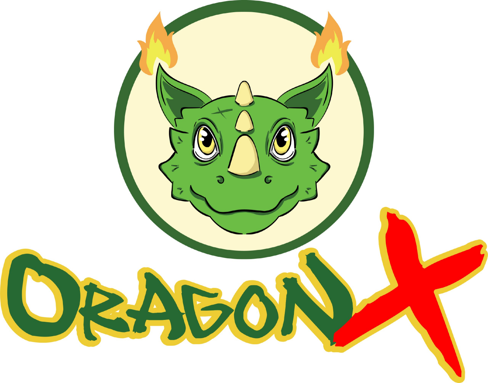

# Introduction

OragonX is a Fantasy Game platform project that uses the NFT system, in which every player will be able to earn income  by developing their own gameplay and contributing to the ecosystem. In the OragonX game, each player will be able to do breeding to boost up the dragon, raise, fight, and get items that can be used to improve the dragon’s ability.

OragonX will be a game full of enjoyment. In the future, it will become a new social media network because of the strong community, plus, it will give an opportunity to earn passive income. This game itself will give a new experience which is “Play to Earn” where the player in the ecosystem will get a reward. This will magnetize and fascinate millions of people, where you not just play the game, but you can get real income from the game itself. Amazing, right?!

Players will be able to get reward from:

* Do the best dragon breeding and sell it in the marketplace
* Sell items from the game
* Raise and improve the dragon up to certain rarity level, it will increase the price in the marketplace
* Victory reward from battle. ​

## Tokenomics 

OragonX token ($ORGN) is the token that runs and uses the BEP-20 network. This token has a maximum supply of 1 Quadrillion (1.000.000.000.000.000) to aim to avoid inflation.OragonX later on will be the main token to use in the game. Every purchase, breeding, and item fusion will use OragonX token.

## Token Distribution 

| Allocation       | Token Quantity         | In percentage |
| ---------------- | ---------------------- | ------------- |
| Burn             | 482,851,172,543,143    | 48.28%        |
| Circulating      | 446.700.000.000.000,00 | 44,74%        |
| Marketing Wallet | 64,534,292,886,077.28  | 6.45%         |
| Pancake Swap     | 15,362,641,864,736.46  | 1.53%         |
| Hotbit           | 7,294,192,869,046.99   | 0.73%         |

**Data taken from 2022.2**&#x20;

* For the latest information, please refer to BSCSCAN (link provided below)

[https://bscscan.com/token/0x88c676fc777c225b69869aeef5d10535de1e4f5d#balances](https://bscscan.com/token/0x88c676fc777c225b69869aeef5d10535de1e4f5d#balances)​

Burn: the total amount of token that have been burned until this moment and in the future there will be more to be burn again.

Circulating: the tokens that are circulated and owned by the holders. The holders are able to buy and sell which affect the circulating supply in pancakeswap.

Marketing wallet: consist of supply that will be used to fill the liquidity for exchange listing&#x20;

\*New DXsale link for LP lock&#x20;

[https://dxsale.app/app/v3/dxlockview?id=0\&add=0x3f719DDCDB386eF2c4E2c5f24DB2DAe61187C894\&type=lplock\&chain=BSC](https://dxsale.app/app/v3/dxlockview?id=0\&add=0x3f719DDCDB386eF2c4E2c5f24DB2DAe61187C894\&type=lplock\&chain=BSC)

## Buy and Sell Tax 

To support the ecosystem development, each of the transaction of buy and sell will be taxed as followed:

* Reflection/auto stacking to give reward for holders, 2% each transaction.
* 6% is allocated for buyback and burn. The team will buy back the token then burn it to the burn address. The team always gives updates whenever do the buyback and burn activities.
* 4% is allocated for marketing, to support OragonX in youtube, instagram, twitter and other media.

· \* always use \~12% slippage to ensure buy and sell activities run smoothly.

