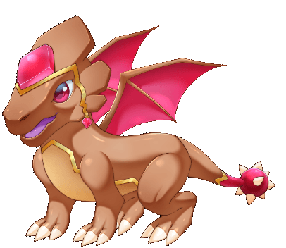

# Akh

## Akh&#x20;

Element : Soil&#x20;

Origin : Egypt In old Egypt mythology, Akh was a legendary creature that lived in the desert near the Nile river. Akh’s look was a mixture of animals. His body is like a snake, head, wing and his four legs resemble a bird. It is said this creature was a griffin legend inspiration in Europe. In some painting, Akh depicted using Uraei (ancient Egypt headdress).


Every dragon power and abilities reflect to their respective origin story

