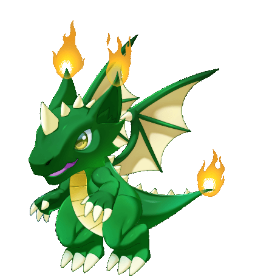

# Meru

## Meru&#x20;

Element : Fire&#x20;

Origin : Indonesia&#x20;

Meru is the guardian of mountains that are often seen in MahaMeru. He has the power of fire, which can turn the fire into stone.&#x20;


Every dragon power and abilities reflect to their respective origin story

