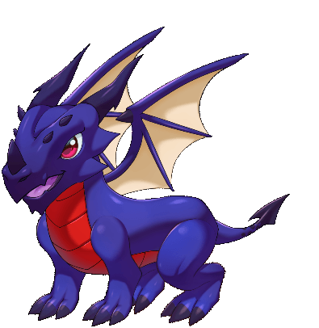

# Metalicana

## Metalicana&#x20;

Element : Steel&#x20;

Origin : Japan Metalicana is a four legged beast, but unlike other dragons, Metalicana’s body is covered with silver-steel scales. Those scales made him look shielded with armour, covered from his neck to breastbone, shoulder, arms, knees, and claws. Around his chest until his calf, the scales are faded and change into chain looking scale Metalicana’s head shape is almost square and he has a switch-like jawline. He’s eyes are like beads of all black color.


Every dragon power and abilities reflect to their respective origin story

