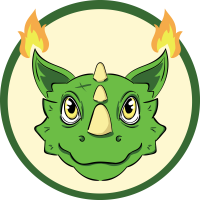

# OragonX Tokenomics

## Tokenomics

OragonX token \($ORGN\) is the token that runs and uses the BEP-20 network. This token has a maximum supply of 1 Quadrillion \(1.000.000.000.000.000\)  to aim to avoid inflation. 

OragonX later on will be the main token to use in the game. Every purchase, breeding, and item fusion will use OragonX token. 

## Token Distribution

|  | **Token Quantity** | **Max Supply** |
| :--- | :--- | :--- |
| **Burn** | 473.848.550.447.012,77 | 47,38% |
| **Circulating** | 446.700.000.000.000,00 | 44,74% |
| **Marketing Wallet** | 60.164.665.717.336,03 | 6.01% |
| **Pancake Swap** | 18.688.907.978.572,88 | 1.87 |

* For more update info, please check in BSCSCAN

            [https://bscscan.com/token/0x88c676fc777c225b69869aeef5d10535de1e4f5d\#balances](https://bscscan.com/token/0x88c676fc777c225b69869aeef5d10535de1e4f5d#balances)

Burn: the total amount of token that have been burned until this moment and in the future there will be more to be burn again. 

Circulating: the tokens that are circulated and owned by the holders. The holders are able to buy and sell which affect the circulating supply in pancakeswap. 

Marketing wallet: consist of supply that will be used to fill the liquidity for exchange listing

The total supply could change anytime from buy and sell activities. The liquidity from pancakeswap is locked in DX Sale until 30th November 2021. The team will add the liquidity and later on will lock again. 

Lock Dxsale 1: [https://dxsale.app/app/v2\_9/dxlockview?id=0&add=0x3f719DDCDB386eF2c4E2c5f24DB2DAe61187C894&type=lplock&chain=BSC](https://dxsale.app/app/v2_9/dxlockview?id=0&add=0x3f719DDCDB386eF2c4E2c5f24DB2DAe61187C894&type=lplock&chain=BSC)

## Buy and Sell Tax


  
To support the ecosystem development, each of the transaction of buy and sell will be taxed as followed:

* Reflection/auto stacking to give reward for holders, 2% each transaction. 
* 6% is allocated for buyback and burn. The team will buy back the token then burn it to the burn address. The team always gives updates whenever do the buyback and burn activities. 
* 4% is allocated for marketing, to support OragonX in youtube, instagram, twitter and other media. 

 ·   \* always use 13% - 20% slippage to ensure buy and sell activities run smoothly.

